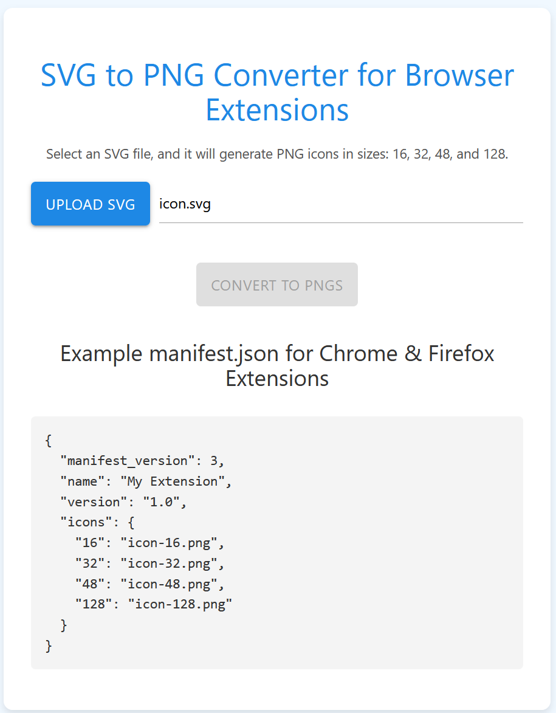

# Browser Extensions Icons

A simple and efficient web tool to convert images into icons for browser extensions in the correct sizes (16x16, 32x32, 48x48, and 128x128 pixels). All processing happens directly in your browser - your images never leave your device.

## Features

- 🎨 Convert any image into browser extension icons
- 📏 Automatically resizes to all required dimensions (16x16, 32x32, 48x48, 128x128)
- 📦 Download individual sizes or all icons in a ZIP file
- 🌐 100% private - all processing happens locally in your browser
- 🚀 Fast and efficient processing
- 💻 Clean, modern interface

## Usage

1. Visit [Browser Extensions Icons](https://lachlanallison.github.io/browserextensionsicons)
2. Upload your source image (stays on your device)
3. Click "Convert"
4. Download individual sizes or get all icons in a ZIP file

## Why Use This Tool?

Browser extensions require icons in specific sizes for their manifests. This tool simplifies the process by automatically generating all required sizes from a single source image, saving you time and ensuring your extension meets the icon requirements. Since everything runs in your browser, it's fast, secure, and works offline once loaded.

## Technical Details

- Built with vanilla JavaScript
- Uses HTML5 Canvas for image processing
- Implements JSZip for creating ZIP archives
- Materialize CSS for the user interface
- Zero server dependencies - everything runs in your browser

## License

This project is licensed under the MIT License - see the [LICENSE](LICENSE) file for details.

## Contributing

Contributions are welcome! Feel free to:
1. Fork the repo
2. Create your feature branch
3. Submit a pull request

## Support

If you find this tool useful, consider:
- ⭐ Starring the repository
- 🐛 Reporting any issues you find
- 💡 Suggesting new features
